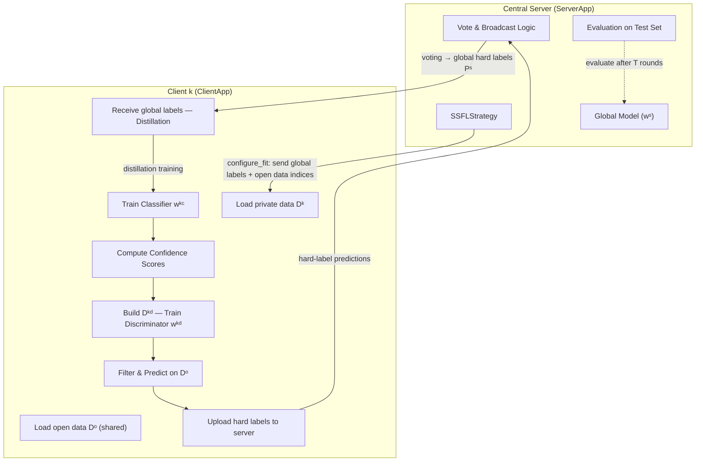

# SSFL Flower Infrastructure — Roadmap, Skeleton & Architecture

> **Paper:** Zhao et al., *"Semisupervised Federated-Learning-Based Intrusion Detection Method for Internet of Things,"* IEEE IoT Journal, Vol. 10, No. 10, May 2023.

---

## 1. Project Context

Your capstone project reproduces the **SSFL** algorithm from the paper above.  The dataset pipeline (`prepare_dataset.py`) is **already done** — it outputs the mini-N-BaIoT data ready for federated training across three non-IID scenarios.  Your team's responsibility is the **Flower infrastructure**: wiring everything together so that K simulated clients perform the SSFL training loop orchestrated by a central server using the [Flower (flwr)](https://flower.ai) framework.

### What already exists

| Artifact | Status |
|---|---|
| `prepared_data/` (private, open, test, scenario_1–3) | ✅ Ready |
| `DATASET_README.md` | ✅ Ready |
| `pyproject.toml` with `flwr>=1.22`, `torch>=2.10`, etc. | ✅ Ready |
| `src/` directory | ❌ Empty — **this is what we build** |

---

## 2. High-Level Architecture



### Mapping Paper's Algorithm 1 → Flower Rounds

Each **Flower communication round** maps to **one full iteration** of Algorithm 1 (Steps 1–5):

| Paper Step | What Happens | Where in Flower |
|---|---|---|
| **Step 1** – Train classifier | Client trains `wᵏᶜ` on private data, computes confidence `cⱼᵏ` | `ClientApp.fit()` — first half |
| **Step 2** – Train discriminator | Client builds `Dᵏᵈ`, trains `wᵏᵈ` | `ClientApp.fit()` — second half |
| **Step 3** – Filter & upload | Client filters predictions via discriminator, uploads hard labels | `ClientApp.fit()` → return `ArrayRecord` |
| **Step 4** – Vote & broadcast | Server aggregates hard labels via voting, produces `Pˢ` | `SSFLStrategy.aggregate_fit()` |
| **Step 5** – Distillation | Client trains classifier on `Dᵒ` with global hard labels | `ClientApp.fit()` — *next round's* first action |

> [!IMPORTANT]
> The SSFL scheme does **not** exchange model parameters — it exchanges **hard labels** on the shared open dataset. This is fundamentally different from standard FedAvg. We will implement a **custom Flower Strategy** to handle this.

---

## 3. Proposed Directory Structure

```
capstone_project/
├── pyproject.toml                  # Already exists — add [tool.flwr] section
├── prepared_data/                  # Already exists — untouched
├── DATASET_README.md               # Already exists — untouched
│
├── src/
│   ├── __init__.py
│   │
│   ├── model.py                    # CNN classifier & discriminator architectures
│   ├── data.py                     # Data loading utilities (wraps prepared_data/)
│   ├── train.py                    # Local training loops (classifier, discriminator, distillation)
│   │
│   ├── client_app.py               # Flower ClientApp definition
│   ├── server_app.py               # Flower ServerApp + SSFLStrategy definition
│   │
│   └── utils.py                    # Helpers: metrics, device selection, serialisation
│
├── conf/
│   └── config.yaml                 # Hyperparameters (lr, epochs, θ, T, scenario, etc.)
│
└── run_simulation.py               # Entry point: `flwr run` or manual simulation script
```

---

## 4. File-by-File Design

### 4.1 `src/model.py` — Neural Network Definitions

**Rationale:** The paper uses the *same CNN backbone* for both the classifier and the discriminator — they differ only in the final output layer (11 classes vs. 2 classes). We define a single `CNNBackbone` and two head wrappers.

```python
# ─── Architecture from Table I of the paper ───
# Input: (batch, 1, 23, 5)
# Conv layers 1-4:  64 kernels, kernel_size=3, padding=1
# Conv layers 5-8: 128 kernels, kernel_size=3, padding=1
# Flatten → FC(128*23*5, 256) → FC(256, 128) → FC(128, num_classes)
# Activation: ReLU after every conv/FC (except last)

class CNNBackbone(nn.Module): ...       # Shared 8-conv-layer feature extractor
class Classifier(nn.Module): ...        # Backbone + FC head → 11 outputs
class Discriminator(nn.Module): ...     # Backbone + FC head → 2 outputs (familiar / unfamiliar)
```

> [!NOTE]
> The paper states the **discriminator** and **classifier** share the *same structure except the output layer*. Both use 8 conv layers (first 4 with 64 filters, last 4 with 128 filters, kernel size 3), followed by a 3-layer MLP. The classifier outputs 11 classes, the discriminator outputs 2.

---

### 4.2 `src/data.py` — Data Loading Utilities

Wraps the existing `prepared_data/` directory, providing clean PyTorch `Dataset` and `DataLoader` objects.

```python
def load_client_data(scenario: int, client_id: int, batch_size: int) -> DataLoader: ...
def load_open_data(batch_size: int) -> DataLoader: ...
def load_test_data(batch_size: int) -> DataLoader: ...
def get_num_clients(scenario: int) -> int: ...
def get_client_summary(scenario: int) -> list[dict]: ...
```

**Key design decisions:**
- Returns **2D-reshaped** data (`X_2d.npy`) by default for CNN input
- Open data loader does **not** expose labels (faithfully reproducing the unlabeled setting)
- All loaders use the pre-computed `feat_min.npy` / `feat_max.npy` normalisation — no re-computation needed

---

### 4.3 `src/train.py` — Local Training Logic

This is the **core algorithmic file** that faithfully implements Algorithm 1 from the paper. It is intentionally decoupled from Flower so it can be unit-tested independently.

```python
def train_classifier(
    model: Classifier,
    dataloader: DataLoader,     # Private data Dᵏ
    epochs: int,
    lr: float,
    device: str,
) -> None:
    """Step 1: Train classifier wᵏᶜ with labelled private data (Eq. 11)."""

def compute_confidence_scores(
    model: Classifier,
    open_loader: DataLoader,    # Open data Dᵒ
    device: str,
) -> tuple[np.ndarray, np.ndarray]:
    """Step 1 (cont.): Compute predictions & confidence cⱼᵏ on Dᵒ (Eq. 12).
    Returns: (predictions [N_o, L], confidences [N_o])
    """

def build_discriminator_dataset(
    confidences: np.ndarray,
    open_data: np.ndarray,       # X_2d from open set
    private_data: np.ndarray,    # X_2d from private set
    theta: float,                # Confidence threshold (median)
) -> DataLoader:
    """Step 2: Build Dᵏᵈ via Eqs. 13-14 (unfamiliar open + all private → familiar)."""

def train_discriminator(
    model: Discriminator,
    dataloader: DataLoader,      # Dᵏᵈ
    epochs: int,
    lr: float,
    device: str,
) -> None:
    """Step 2: Train discriminator wᵏᵈ."""

def filter_and_predict(
    classifier: Classifier,
    discriminator: Discriminator,
    open_loader: DataLoader,
    device: str,
) -> np.ndarray:
    """Step 3: Filter predictions via Eq. 16.
    Returns: hard labels array [N_o] with -1 for unfamiliar samples.
    """

def distillation_train(
    model: Classifier,
    open_loader: DataLoader,     # Open data Dᵒ
    global_labels: np.ndarray,   # Pˢ from server (hard labels)
    epochs: int,
    lr: float,
    device: str,
) -> None:
    """Step 5: Train classifier on open data with global hard labels (Eq. 18)."""
```

---

### 4.4 `src/client_app.py` — Flower Client Application

**Rationale:** We use Flower's modern `ClientApp` + Message API architecture. Each client's `fit()` function performs the full local SSFL iteration.

```python
from flwr.clientapp import ClientApp
from flwr.app import Context, Message, RecordDict, ArrayRecord

app = ClientApp()

@app.train()
def train(msg: Message, ctx: Context) -> Message:
    """
    One SSFL round from the client's perspective:
    
    1. Receive global hard labels Pˢ from server (empty on round 0)
    2. If Pˢ exists → Step 5: distillation training on Dᵒ with Pˢ
    3. Step 1: Train classifier on private data Dᵏ
    4. Step 1 cont.: Compute confidence scores on Dᵒ
    5. Step 2: Build Dᵏᵈ, train discriminator
    6. Step 3: Filter predictions, produce hard labels
    7. Return hard labels to server via ArrayRecord
    """
```

**State management:** Each client persists its `Classifier` and `Discriminator` models across rounds using `ctx.state` (Flower's stateful client mechanism).

---

### 4.5 `src/server_app.py` — Flower Server & Custom Strategy

**This is the most critical Flower-specific file.** The SSFL paper requires a **custom aggregation strategy** because we aggregate *hard labels via voting*, not model parameters.

```python
from flwr.serverapp import ServerApp
from flwr.serverapp.strategy import Strategy

class SSFLStrategy(Strategy):
    """
    Custom strategy implementing the SSFL server logic.
    
    Key overrides:
    - configure_fit():   Send global hard labels Pˢ (or empty on round 0) to each client
    - aggregate_fit():   Receive hard labels from all clients → Step 4: Vote & Broadcast
    - configure_evaluate(): Send global model for centralised evaluation
    - aggregate_evaluate(): Collect and log metrics
    """
    
    def __init__(
        self,
        num_rounds: int,
        num_classes: int = 11,
        num_open_samples: int = 8900,
        fraction_fit: float = 1.0,      # Sample all clients each round
        min_fit_clients: int = 2,
    ): ...
    
    def aggregate_fit(self, server_round, results, failures):
        """
        Step 4 — Vote & Broadcast (Eq. 17):
        For each open sample j:
          - Collect hard labels from all clients (ignoring -1 = unfamiliar)
          - Majority vote → global hard label pˢⱼ
        Returns global hard labels Pˢ as ArrayRecord.
        """
```

> [!WARNING]
> Standard `FedAvg` aggregates model weights. SSFL aggregates **hard labels**. You **cannot** use `FedAvg` out of the box — you must implement a custom `Strategy` subclass. This is the core of the Flower infrastructure work.

---

### 4.6 `src/utils.py` — Shared Utilities

```python
def get_device() -> str: ...                         # "cuda" | "mps" | "cpu"
def set_seed(seed: int) -> None: ...                 # Reproducibility
def compute_metrics(y_true, y_pred) -> dict: ...     # Accuracy, F1, Precision, Recall
def labels_to_array_record(labels: np.ndarray) -> ArrayRecord: ...
def array_record_to_labels(record: ArrayRecord) -> np.ndarray: ...
```

---

### 4.7 `conf/config.yaml` — Centralised Configuration

```yaml
# ─── SSFL Hyperparameters (from paper Section V-C) ───
model:
  num_classes: 11
  num_discriminator_classes: 2

training:
  learning_rate: 0.0001
  batch_size: 100
  local_epochs: 5           # Local training epochs per round
  discriminator_epochs: 5    # Discriminator training epochs
  distillation_epochs: 5     # Distillation epochs per round

federation:
  num_rounds: 200            # Communication rounds T
  scenario: 1                # Which data split (1, 2, or 3)
  fraction_fit: 1.0          # Fraction of clients participating each round

seed: 42
```

---

### 4.8 `run_simulation.py` — Entry Point

```python
"""
Entrypoint for running the SSFL experiment.

Usage:
    uv run python run_simulation.py --scenario 1 --rounds 200

This uses Flower's simulation engine to run K virtual clients
on a single machine, faithfully reproducing the paper's setup.
"""
```

---

## 5. Phased Development Roadmap

### Phase 1 — Foundation (Week 1)
> Get the building blocks working independently, without Flower.

- [ ] **1.1** Implement `src/model.py` — CNN backbone, Classifier, Discriminator
- [ ] **1.2** Implement `src/data.py` — data loaders wrapping `prepared_data/`
- [ ] **1.3** Implement `src/utils.py` — device detection, seeding, metrics
- [ ] **1.4** Write unit tests: model forward pass shapes, data loading correctness
- [ ] **1.5** Implement `src/train.py` — all 6 training functions
- [ ] **1.6** Validate with a standalone (non-federated) sanity check: train classifier on one client's data, evaluate on test set

### Phase 2 — Flower Integration (Week 2)
> Wire everything into the Flower framework.

- [ ] **2.1** Implement `src/client_app.py` — client-side SSFL logic using `ClientApp`
- [ ] **2.2** Implement `src/server_app.py` — `SSFLStrategy` with voting aggregation
- [ ] **2.3** Implement `run_simulation.py` — simulation harness
- [ ] **2.4** Update `pyproject.toml` with Flower configuration (`[tool.flwr.app]` section)
- [ ] **2.5** Run a minimal end-to-end test: 3 clients, 5 rounds, Scenario 1

### Phase 3 — Full Experiments & Evaluation (Week 3)
> Reproduce the paper's results across all three scenarios.

- [ ] **3.1** Scenario 1: 27 clients, 200 rounds — track accuracy, F1, comm overhead
- [ ] **3.2** Scenario 2: 89 clients, 200 rounds
- [ ] **3.3** Scenario 3: 89 clients, 200 rounds (Dirichlet α=0.1)
- [ ] **3.4** Generate confusion matrices (Fig. 3 from paper)
- [ ] **3.5** Generate accuracy curves over rounds (Fig. 4 from paper)
- [ ] **3.6** Compute communication overhead comparison table (Table IV)

### Phase 4 — Ablation & Polish (Week 4)
> Ablation studies and final deliverables.

- [ ] **4.1** Ablation: SSFL without discriminator
- [ ] **4.2** Ablation: SSFL without voting (direct aggregation)
- [ ] **4.3** Ablation: different θ_c values (0.7, 0.8, 0.9, median)
- [ ] **4.4** Ablation: soft labels vs. hard labels comparison
- [ ] **4.5** Write final report / documentation
- [ ] **4.6** Clean up code, add docstrings, finalize README

---

## 6. Key Technical Decisions & Rationale

### Why a Custom Strategy (not FedAvg)?

FedAvg aggregates **model parameters** (`NDArrays`) by weighted averaging. SSFL aggregates **hard-label predictions** on a shared open dataset via a **voting mechanism**. The data format, aggregation logic, and communication pattern are all fundamentally different. A custom `Strategy` subclass is the cleanest way to implement this in Flower.

### Why Flower Simulation instead of `flwr run` deployment?

For a capstone project running on a single machine, Flower's simulation engine (`flwr.simulation`) is the right choice:
- Simulates K clients as lightweight processes — no need for K separate machines
- Supports GPU sharing across clients via Ray
- Produces identical results to a real distributed deployment 
- Dramatically simplifies debugging and iteration

### Client State Across Rounds

Each SSFL client maintains **two persistent models** (classifier + discriminator) across communication rounds. Flower's `Context.state` mechanism handles this. We serialize model state dicts into the state at the end of each round and restore them at the start of the next.

### Communication Format

The paper exchanges **hard labels** (integer predictions per open-data sample). In Flower's Message API:
- Server → Client: `ArrayRecord` containing `int64` array of shape `(N_open,)` = global hard labels
- Client → Server: `ArrayRecord` containing `int64` array of shape `(N_open,)` = filtered local hard labels (with -1 for unfamiliar)

This is extremely communication-efficient (paper's key advantage).

---

## 7. Open Questions

> [!IMPORTANT]
> **Q1:** Which **scenario** should we prioritize for initial development and debugging? I recommend **Scenario 1 (27 clients)** as it's the simplest and fastest to iterate on.

> [!IMPORTANT]  
> **Q2:** Do you want the Flower infrastructure to support **all three scenarios** via configuration, or should we hardcode one scenario initially?

> [!NOTE]
> **Q3:** The paper mentions training the server's global model with `Pˢ` (Eq. 10). This is a secondary model used for evaluation. Should we implement this, or evaluate directly using one client's model?

> [!NOTE]
> **Q4:** For the **confidence threshold θ**, the paper uses the median of each client's predicted probabilities (not a fixed value). This is already reflected in the design — just confirming you want to follow the paper exactly.

---

## 8. Verification Plan

### Automated Tests
```bash
# Unit tests for model shapes
uv run python -m pytest tests/test_model.py

# Unit tests for data loading
uv run python -m pytest tests/test_data.py

# Integration test: 3 clients, 5 rounds, Scenario 1
uv run python run_simulation.py --scenario 1 --rounds 5 --test
```

### Correctness Benchmarks
- **Single-client baseline:** Train classifier on one client's data without FL → establish baseline accuracy
- **Scenario 1 after 10 rounds:** Should see accuracy above 50% (paper shows ~70% at round 10)
- **Scenario 1 after 150 rounds:** Should approach 90%+ accuracy (paper's convergence point)

### Paper Reproduction Targets (Table II)
| Scenario | Target Accuracy | Target F1 |
|---|---|---|
| 1 | ~92% | ~91% |
| 2 | ~89% | ~88% |
| 3 | ~85% | ~84% |
